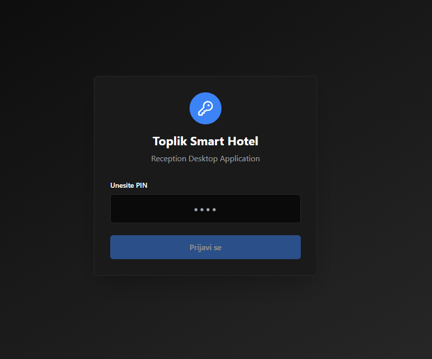
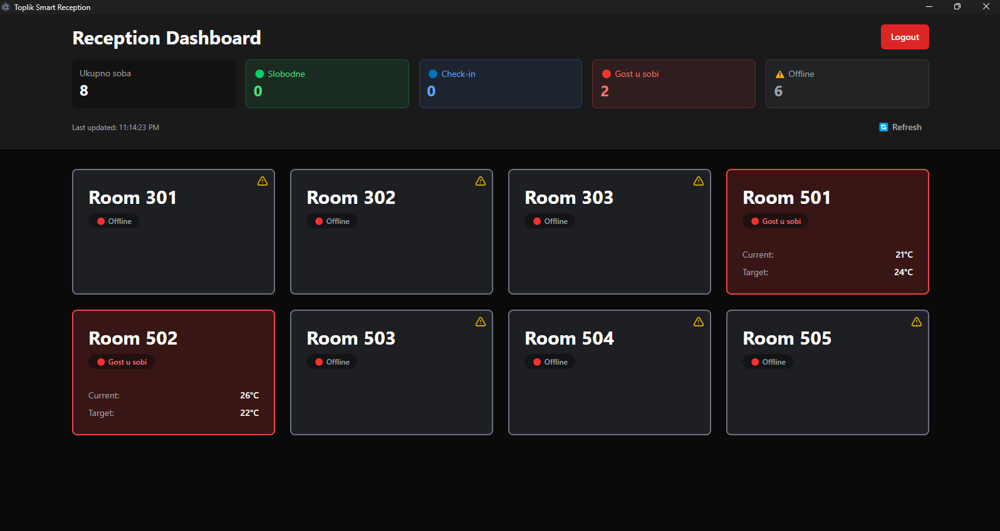
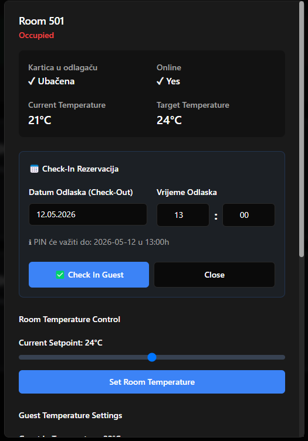
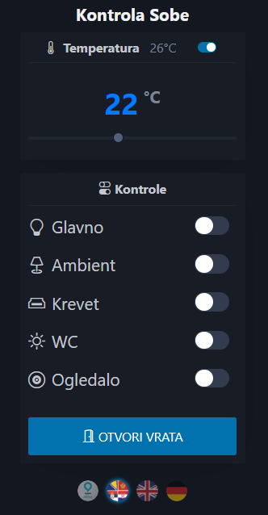
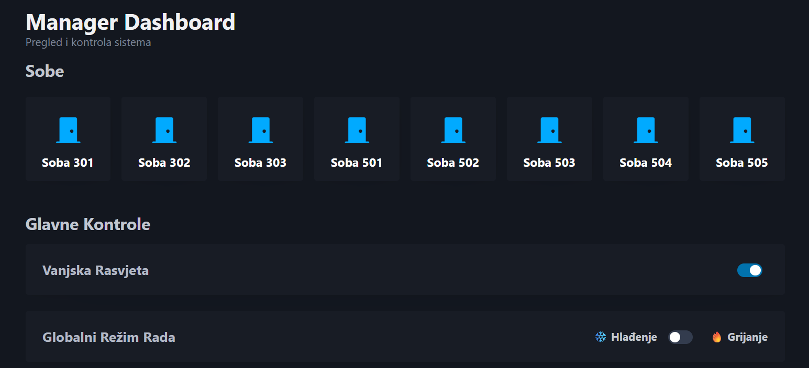
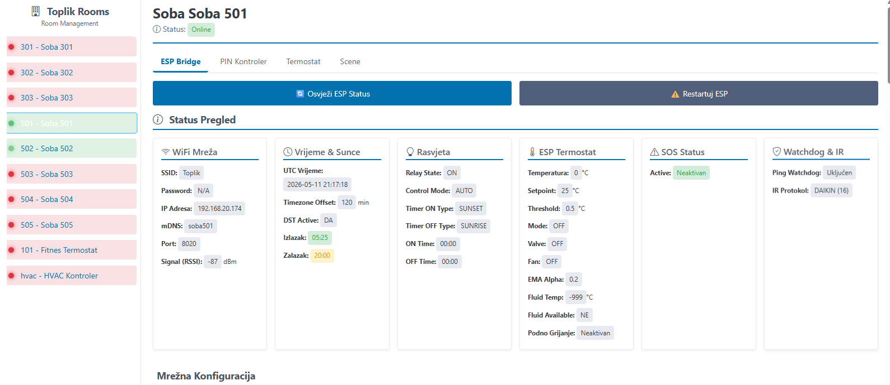

# Roomly


**Roomly** is a smart hospitality control platform built around a **central Raspberry Pi 3B Python server** that coordinates reception operations, guest room access, smart room control, voice control, management interfaces, and room-device routing across the property.

The central server connects and orchestrates:

- the **Windows 11 Electron reception application**
- **8 guest rooms** with smart-room control
- a **Raspberry Pi 3A+ in every room**
- **Alexa + HA Bridge** voice control inside every room
- **8 HTTPBridge room-control devices**
- **3 STM32F746 Smart Room displays per room** connected through the HTTPBridge layer
- a **MIFARE card reader writer** with STM32F103 + USB HID integration
- **1 heating controller**
- **1 thermostat for the fitness room**
- the guest **smart room web application** hosted from the central server
- a **mobile Android reservation workflow** used outside regular reception hours

The code in this repository reflects a real multi-part hospitality-control system rather than a standalone demo project.

---

## Screenshots

### Reception Desktop Application




### Guest Room Control


### Operations and Management



---

## What Roomly does

From the code currently in this repository and from the described production architecture, Roomly provides a practical software stack for a hospitality environment branded in the project as **Toplik Smart Hotel / Toplik Reception / Toplik Village Resort**.

The project combines:

- a **desktop reception application** built with Electron, React, and TypeScript
- a **central Python backend** built with Flask and Waitress
- a **guest room control interface** with multilingual UI
- a **manager heating control panel**
- an **admin dashboard and admin login flow**
- **thermal printer slip generation** with QR code output
- a **MIFARE card reader writer** workflow integrated into reception operations
- **MIFARE card reader writer** hardware based on **STM32F103 + USB HID**
- **per-room Raspberry Pi 3A+ nodes** for in-room automation
- **HA Bridge and Alexa voice control** for each room
- a **central Raspberry Pi 3B server** coordinating room-facing and operational services
- **HTTPBridge-based room-device routing**
- **STM32F746 Smart Room displays** attached to the room-control layer
- a **mobile reservation workflow** for after-hours guest check-in

The result is a hybrid property-control platform where desktop software, backend logic, web interfaces, room devices, voice control, and custom hardware work together under one central server.

---

## Hardware and Software Ecosystem

Roomly should not be viewed as a standalone app. It is the central software layer of a wider operational ecosystem built from connected software and hardware components.

This ecosystem includes:

- the **Roomly Electron reception application**
- the **central Raspberry Pi 3B Python backend**
- the **guest smart room web application**
- **per-room Raspberry Pi 3A+ nodes**
- **Alexa + HA Bridge** integration in every room
- **HTTPBridge** room-control routing devices
- **3 STM32F746 Smart Room displays per room**
- a **MIFARE card reader writer** device based on **STM32F103 + USB HID**
- heating and thermostat control infrastructure
- an **Android reservation workflow** for out-of-hours operation

This is important because the project is meant to present a **fully operational field-deployed hardware/software ecosystem**, not a demo stack.

As the related repositories are finalized, this README can evolve into a connected entry point where items such as:

- **MIFARE card reader writer**
- **HTTPBridge**
- **STM32F746 Smart Room displays**

will appear as linked ecosystem components that open their dedicated repositories.

---

## Central Server Architecture

The most important architectural point of the whole system is this:

**the Raspberry Pi 3B is the central Python server for everything.**

It is the single coordination point to which all major software and automation layers connect.

### The central Raspberry Pi 3B server connects to

- the **Electron Windows 11 reception application**
- the **MIFARE card reader writer** workflow and hardware integration
- the **per-room Raspberry Pi 3A+ Alexa / HA Bridge nodes**
- the **smart room guest web application**
- the **8 room-control paths through HTTPBridge**
- the **fitness heating controller**
- the **fitness thermostat**
- the **Android mobile reservation flow** used outside reception working hours

### Room-level architecture

Each of the **8 rooms** has its own control chain:

- a room is managed by the **central Raspberry Pi 3B server**
- the room also has a dedicated **Raspberry Pi 3A+**
- that Raspberry Pi 3A+ runs **HA Bridge**
- Alexa voice commands for that room are resolved through **AWS**, received by the room Raspberry Pi 3A+, and routed through **HA Bridge** toward the **central Raspberry Pi 3B server**
- the room-control path also includes an **HTTPBridge device**
- on each room HTTPBridge device there are **3 STM32F746 Smart Room displays**, as defined in the wider HTTPBridge-based room architecture

This means every room supports:

- web-based smart room control
- PIN-based access logic
- reception-side room issuance
- device-level room routing
- in-room Alexa voice commands
- visual Smart Room display integration

---

## Voice Control and Alexa Routing

One of the strongest features of the system is that **Alexa is integrated into every room**.

This is not a separate standalone subsystem. It is part of the main Roomly architecture.

### Alexa command flow

A typical room voice command follows this path:

```text
Guest speaks to Alexa in the room
        -> AWS resolves the voice intent
        -> room Raspberry Pi 3A+ receives the command
        -> HA Bridge routes the request
        -> central Raspberry Pi 3B Python server processes the command
        -> central server routes the command through the room-control infrastructure
        -> room device state changes
```

Because of that design, Alexa is fully tied into the same smart room ecosystem as:

- the guest web interface
- the reception application
- the room PIN system
- the central room-control backend

---

## Smart Room Access and PIN Logic

The guest smart room application is hosted by the **central Raspberry Pi 3B server**.

Each room has its own room-control path, and the server distinguishes rooms through a guest PIN workflow.

### PIN-based room logic

According to your architecture description:

- the **same PIN** is used both for **opening the room** and for accessing the **smart room application**
- the central server is responsible for assigning and managing these PINs
- PIN generation uses **RNG-based logic**
- the server ensures that **the same active PIN is not assigned twice at the same time**

This makes the room-access flow tightly integrated with the guest control experience.

### Practical access flow

```text
Reception issues a room
        -> central server generates a unique active PIN
        -> guest receives room number + PIN
        -> the same PIN works for room access and smart room access
        -> guest opens the room-control app served by the central server
        -> room is controlled through web UI and can also be controlled by Alexa in the room
```

---

## After-Hours Reservation Flow

The system also supports a mobile-assisted workflow outside standard reception hours.

An **Android application** can occasionally be used for booking or assigning a room when reception is closed.

In that after-hours flow:

- a guest can be assigned a room remotely
- the guest receives the **room PIN**
- the guest can use the room outside regular working hours
- the same PIN gives access to the smart room workflow
- the next morning the guest can collect the physical card at reception

This means Roomly supports both:

- standard in-person reception issuance
- controlled out-of-hours room assignment through the mobile-connected workflow

---

## Repository structure

```text
Roomly/
├── docs/images/      # README screenshots and visual assets
├── reception-app/    # Windows 11 desktop reception application
├── server-rpi/       # Production backend for the central Raspberry Pi 3B
├── server-win/       # Windows localhost backend used for development/testing
└── README.md
```

---

## Component breakdown

### `reception-app`

This is the reception workstation application.

It is an Electron desktop app with a React + TypeScript frontend and local Windows-oriented integrations.

### Confirmed stack from the project files

- Electron
- React
- TypeScript
- Webpack
- Tailwind CSS
- SQLite via `better-sqlite3`
- `electron-store`
- Python helper scripts

### What the reception app is used for

Based on the code and configuration, the desktop app is intended for:

- PIN-based reception and manager login
- hotel configuration and local settings
- communication with the central Raspberry Pi 3B backend
- local printer integration
- local card-reader / card-writer support
- Windows-based front desk operation
- room issuance workflows

### Evidence from the code

- `reception-app/package.json` identifies the app as **Toplik Smart Hotel - Reception Desktop Application**
- `reception-app/src/renderer/pages/Login.tsx` shows PIN-based login for **reception** and **manager** roles
- `reception-app/src/main/config.ts` defines hotel name, WiFi SSID, printer name, ntfy alerts, and Raspberry Pi connection settings
- `reception-app/printer.py` prints multilingual thermal slips containing room, PIN, WiFi info, and a QR URL pointing to the Raspberry Pi backend
- `reception-app/cardrw/setup_reader.bat` installs Python dependencies for card reader setup
- `reception-app/SETUP_NEW_PC.ps1` prepares a full Windows machine for operation

### Reception app structure

```text
reception-app/
├── src/main/        # Electron/main-process logic and config
├── src/renderer/    # React frontend
├── src/shared/      # shared code
├── cardrw/          # card reader / writer support
├── printer.py       # thermal printer integration
└── SETUP_NEW_PC.ps1 # full new-PC setup
```

### Reception workstation setup

The repository already includes an installation script for a new PC:

- `reception-app/SETUP_NEW_PC.ps1`

From the script content, it prepares:

- Node.js
- Python 3
- Visual Studio Build Tools
- npm dependencies
- Electron native rebuild
- card reader Python dependencies
- `.env` bootstrap
- a desktop shortcut for the application

### Development commands

```bash
cd reception-app
npm install
npm run dev
```

### Packaging

```bash
cd reception-app
npm run build
npm run package:win
```

---

### `server-rpi`

This is the Raspberry Pi production backend.

It contains the deployed Python server, templates, static assets, authentication pages, control endpoints, and room-facing pages.

### Confirmed stack from the project files

- Python
- Flask
- Waitress
- Requests
- PyJWT

### What the Raspberry Pi backend does

Based strictly on the files present in this repository, `server-rpi` is responsible for:

- serving guest room control pages
- serving admin and manager login pages
- providing backend APIs for room control
- handling manager heating control
- communicating with device-control layers
- producing current device and thermostat state for the frontend
- acting as the **central Raspberry Pi 3B Python server** in the property architecture
- coordinating room access, room PIN logic, and smart room control routing

### Templates currently present

```text
server-rpi/templates/
├── admin.html
├── admin_login.html
├── login.html
├── manager.html
├── manager_heating.html
├── manager_login.html
└── soba.html
```

These are not placeholders. They show that the backend already includes multiple real operational UIs:

- **`soba.html`** — guest-facing room control page
- **`manager_heating.html`** — manager-facing heating/pump control page
- **`admin_login.html`** — admin authentication
- **`manager_login.html`** — manager authentication
- **`admin.html` / `manager.html`** — dashboard-level pages

### Guest room control features visible in `soba.html`

The room control page already includes:

- thermostat setpoint control
- thermostat ON/OFF switch
- control of multiple lighting zones:
  - main light
  - ambient light
  - bed light
  - WC light
  - mirror light
- open door action
- multilingual switching:
  - BHS
  - English
  - German
- Alexa instructions overlay for voice-command guidance
- polling of real status from backend APIs

This means the backend is not just exposing data — it is already serving a complete guest control experience.

### Manager heating features visible in `manager_heating.html`

The manager heating page includes control and status for:

- thermostat temperature setpoint
- thermostat ON/OFF
- fancoil pump mode
- fancoil pump manual ON/OFF
- floor-heating pump mode
- floor-heating pump manual ON/OFF
- real RUN/STOP pump status indicators

The backend code in `server-rpi/server.py` also confirms HVAC / thermostat / pump status handling and command synchronization.

### Raspberry Pi backend commands

```bash
cd server-rpi
pip install -r requirements.txt
python server.py
```

---

### `server-win`

This folder is the Windows localhost development copy of the backend.

It mirrors the server-side application structure used on Raspberry Pi, but exists specifically to make development, localhost testing, and debugging easier on a Windows machine.

### Why this folder exists

The repository makes this workflow clear:

- backend changes are easier to build and debug on Windows
- the same functional backend is then prepared for the Raspberry Pi runtime
- templates and operational pages can be tested locally before deployment

### Confirmed from the files

`server-win` contains:

- `server.py`
- `templates/`
- `static/`
- `instaliraj_biblioteke.bat`
- `pokreni_server.bat`

The templates present in `server-win/templates` match the operational pages found in `server-rpi/templates`, which confirms that the Windows backend is a real development environment for the same application logic.

### Local install and run

```bat
cd server-win
instaliraj_biblioteke.bat
pokreni_server.bat
```

Or manually:

```bash
cd server-win
pip install -r requirements.txt
python server.py
```

---

## Confirmed functional areas from the codebase

This README is intentionally based on the actual repository contents. The following capabilities are visible directly in the files and in the described deployment architecture.

### 1. Reception login and role separation

The Electron app login flow supports role-based PIN access for at least:

- reception
- manager

The renderer login page checks locally stored role PINs and routes the user accordingly.

### 2. Hotel and infrastructure configuration

The Electron configuration file includes runtime settings for:

- hotel name
- WiFi SSID
- QR URL generation
- Raspberry Pi host and port
- printer configuration
- SOS notification topic via `ntfy.sh`
- default temperatures
- checkout time
- application dimensions and identity

### 3. Guest thermal slip printing

`reception-app/printer.py` generates a real guest slip containing:

- hotel name
- room number
- guest PIN
- WiFi network name
- QR code for smart room control
- checkout time
- multilingual output:
  - Serbian/BHS
  - English
  - German

The script uses **Windows spooler printing** with ESC/POS commands, which shows this is intended for an actual thermal-printer workflow at reception.

### 4. Guest room control UI

The guest page in `server-rpi/templates/soba.html` provides direct control over:

- room temperature
- thermostat power
- multiple lighting circuits
- door opening
- guest language switching
- Alexa usage instructions

### 5. Manager heating control

The manager heating page and backend logic expose:

- thermostat state and setpoint
- HVAC pump mode switching
- manual/automatic control behavior
- live RUN/STOP feedback

### 6. Admin and manager authentication

Separate login pages exist for:

- admin access
- manager access

This indicates the system already has distinct operational roles on the web/backend side in addition to the desktop app roles.

### 7. Room-level Alexa integration

Beyond the web UI itself, the system architecture includes a Raspberry Pi 3A+ in every room running HA Bridge and connected to the central Raspberry Pi 3B backend. This gives each room a voice-control layer in addition to the Roomly web-based guest interface.

### 8. Room-device routing through HTTPBridge

Each room is part of an HTTPBridge-based room-device chain, and each room path also includes Smart Room display hardware based on STM32F746 devices.

### 9. MIFARE card reader writer integration

The ecosystem also includes a **MIFARE card reader writer** device based on **STM32F103 + USB HID**. This hardware belongs to the wider Roomly environment and complements room issuance, physical access workflows, and reception-side hardware integration.

### 10. After-hours guest entry workflow

The system supports a scenario where a guest can receive a room PIN remotely, use the room outside working hours, and collect the card later at reception.

---

## Architecture

The repository and the described deployment show five main layers:

1. **Reception workstation layer** on Windows 11
2. **Central backend layer** on Raspberry Pi 3B
3. **Per-room voice and automation nodes** on Raspberry Pi 3A+
4. **Room-device and display infrastructure** routed through HTTPBridge
5. **MIFARE access-hardware integration** for card workflows

### System-wide architecture

```text
+-----------------------------+
| Windows 11 Reception App    |
| Electron + React            |
+-------------+---------------+
              |
              | room issuing / PIN management / operations
              v
+---------------------------------------------------------+
| Central Raspberry Pi 3B                                 |
| Roomly Python server                                    |
| Flask + Waitress                                        |
| Central logic for rooms, PINs, guest app, control flows |
+-------------+----------------------+--------------------+
              |                      |                    |
              |                      |                    |
              v                      v                    v
+----------------------+  +----------------------+  +----------------------+
| Guest smart room UI  |  | Manager/Admin UIs    |  | Android reservation  |
| hosted by RPi 3B     |  | hosted by RPi 3B     |  | flow (occasional)    |
+----------------------+  +----------------------+  +----------------------+
              |
              v
+---------------------------------------------------------+
| 8 Room-control paths                                    |
| each room identified and controlled by the central host |
+-------------+-------------------------------------------+
              |
              +-------------------------------------------------------------+
              |                                                             |
              v                                                             v
+-----------------------------+                             +-----------------------------+
| Room Raspberry Pi 3A+       |                             | HTTPBridge device           |
| Alexa + HA Bridge           |                             | room-control routing        |
+-------------+---------------+                             +-------------+---------------+
              |                                                             |
              |                                                             +-----------------------------+
              |                                                                                           |
              v                                                                                           v
+-----------------------------+                                       +---------------------------------------------+
| AWS Alexa resolution        |                                       | 3 x STM32F746 Smart Room displays per room |
| -> room RPi 3A+             |                                       +---------------------------------------------+
| -> HA Bridge                |
| -> central RPi 3B           |
+-----------------------------+

+-----------------------------+
| MIFARE card reader writer   |
| STM32F103 + USB HID         |
| reception-side hardware     |
+-------------+---------------+
              |
              v
+-----------------------------+
| Windows 11 Reception App    |
| and central Roomly workflow |
+-----------------------------+
```

### Operational environment view

```text
+----------------------+        +----------------------+        +----------------------+
| Reception PC         | -----> | Central RPi 3B       | -----> | 8 Room RPi 3A+ nodes |
| Windows 11 app       |        | Roomly backend       |        | Alexa + HA Bridge    |
+----------+-----------+        +----------+-----------+        +----------+-----------+
           |                               |                               |
           |                               |                               v
           v                               v                    +----------------------+
+----------------------+        +----------------------+        | AWS Alexa intents    |
| Thermal printer      |        | Guest / Manager /    |        +----------------------+
| MIFARE card reader   |        | Admin web interfaces |
| Card writer          |        +----------+-----------+
+----------------------+                   |
                                           v
                                +----------------------+
                                | HTTPBridge layer     |
                                | 8 room paths         |
                                +----------+-----------+
                                           |
                                           v
                                +----------------------+
                                | 3 x STM32F746 per    |
                                | room + room devices  |
                                +----------------------+
```

### Fitness control branch

In addition to the 8 guest rooms, the central server also coordinates a dedicated fitness-control branch that includes:

- **1 heating controller**
- **1 thermostat for the fitness room**

This branch is represented in the repository by the manager heating interface and the related backend control/status logic.

### Guest access and control flow

The printed slip generated by `printer.py` contains:

- room number
- guest PIN
- WiFi details
- a QR URL derived from Raspberry Pi host and port

That establishes a concrete operational flow:

```text
Reception issues a room
        -> central server generates a unique active PIN
        -> guest receives room number + PIN
        -> the same PIN is used for room access and the smart room application
        -> guest scans QR code or opens the room-control page hosted by the central RPi 3B
        -> guest controls room temperature, lights, and room functions
        -> Alexa in the room can issue voice commands through AWS -> room RPi 3A+ -> HA Bridge -> central RPi 3B
        -> central server routes the command through the room-control infrastructure
```

### Why the central server matters

The Raspberry Pi 3B is the system coordinator that ensures:

- room assignment logic stays centralized
- smart room sessions are tied to the correct room PIN
- duplicate active PINs are prevented
- the same room can be controlled from the web app, reception workflows, and Alexa voice paths
- card workflows can be coordinated with reception operations
- the entire property behaves as one coordinated system instead of disconnected subsystems

---

## Development workflow

The codebase itself makes the intended workflow clear.

### Backend workflow

```text
Develop locally in server-win
    -> test on localhost
    -> validate templates, APIs, and control logic
    -> copy / deploy to server-rpi
    -> run in production on the central Raspberry Pi 3B
```

### Desktop workflow

```text
Prepare Windows workstation
    -> run SETUP_NEW_PC.ps1
    -> install Node.js / Python / Build Tools
    -> install card reader dependencies
    -> build/package reception desktop app
    -> run on reception PC
```

### Hospitality control workflow

```text
Reception operator uses desktop app
    -> system prepares guest access data
    -> thermal printer prints access slip with QR code
    -> MIFARE card reader writer supports card workflows
    -> guest opens room-control page
    -> central backend serves live room control and operational interfaces
    -> room Raspberry Pi 3A+ node provides HA Bridge and Alexa voice control inside the room
    -> HTTPBridge and Smart Room hardware complete the room-level control path
```

---

## Technology summary

### Desktop layer

- Electron
- React
- TypeScript
- Webpack
- Tailwind CSS
- better-sqlite3
- electron-store

### Backend layer

- Python
- Flask
- Waitress
- Requests
- PyJWT

### Windows-specific integrations

- Python-based ESC/POS thermal printing through `win32print`
- card reader / card writer setup with Python dependencies
- batch and PowerShell automation scripts

### Property-control infrastructure

- central Raspberry Pi 3B backend
- 8 per-room Raspberry Pi 3A+ nodes
- HA Bridge
- Alexa voice control
- HTTPBridge routing layer
- 3 STM32F746 Smart Room displays per room
- MIFARE card reader writer with STM32F103 + USB HID
- fitness heating controller
- fitness thermostat
- Android-assisted after-hours reservation workflow

---

## Why the repository is structured this way

This repository has a very practical layout because it reflects how the software is actually operated.

- `reception-app` is the operator-facing application used on a Windows reception PC
- `server-win` is the development and localhost testing backend
- `server-rpi` is the production backend intended for the central Raspberry Pi 3B deployment

This separation is not generic architecture styling — it matches the real workflow already visible in the code and in the described room setup:

- Windows workstation setup scripts
- production Raspberry Pi configuration
- locally testable backend templates
- printer and card-related local integrations
- guest room control served from the backend
- room-level Alexa control provided by Raspberry Pi 3A+ nodes with HA Bridge
- centralized routing and control through the Raspberry Pi 3B Python server
- MIFARE card reader writer integration for physical access workflows

---

## Project identity visible in the code

Names and branding currently visible in the repository include:

- **Roomly**
- **Toplik Smart Hotel**
- **Toplik Smart Reception**
- **Toplik Village Resort**
- **Toplik Reception**

That branding appears in the desktop app metadata, UI text, configuration defaults, and printer output.

---

## Summary

Roomly is a real hospitality-control software stack that already combines:

- a Windows reception desktop application
- a central Raspberry Pi 3B Python backend
- 8 guest-room control paths
- per-room Raspberry Pi 3A+ Alexa nodes
- guest room control pages
- manager heating control
- admin and manager authentication
- thermal printer guest-slip generation
- MIFARE card reader writer integration
- card reader / card-writer support
- multilingual guest-facing interaction
- HTTPBridge-based device routing
- 3 STM32F746 Smart Room displays per room
- after-hours mobile-assisted reservation capability

This repository does not just describe the platform — it already contains the active software layers that make the reception, room-control, room-access, hardware-integration, card-management, and voice-control workflow possible.
